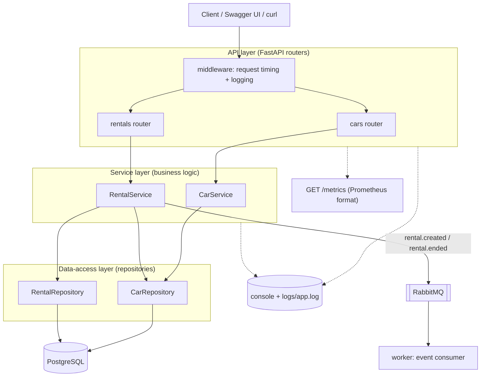
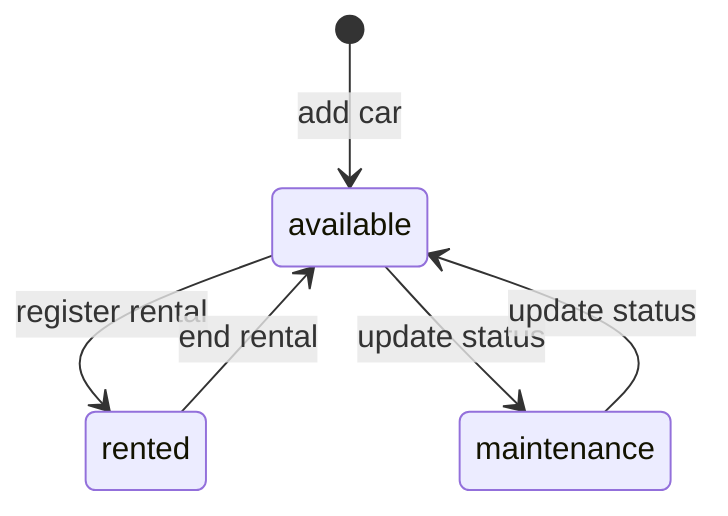
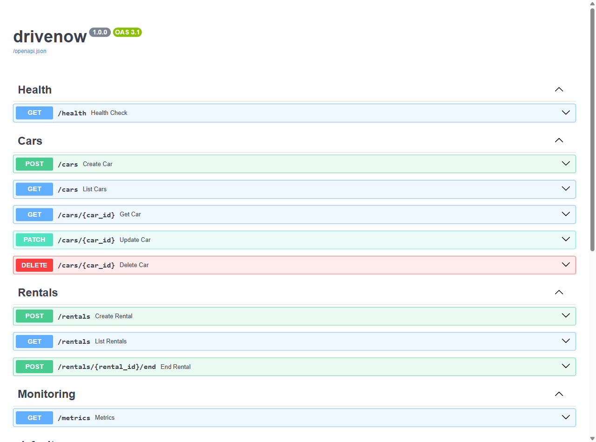
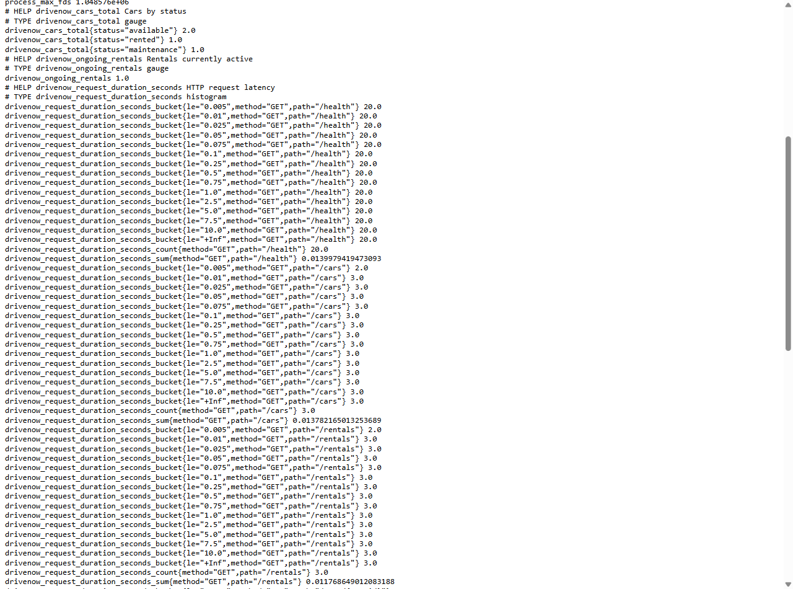
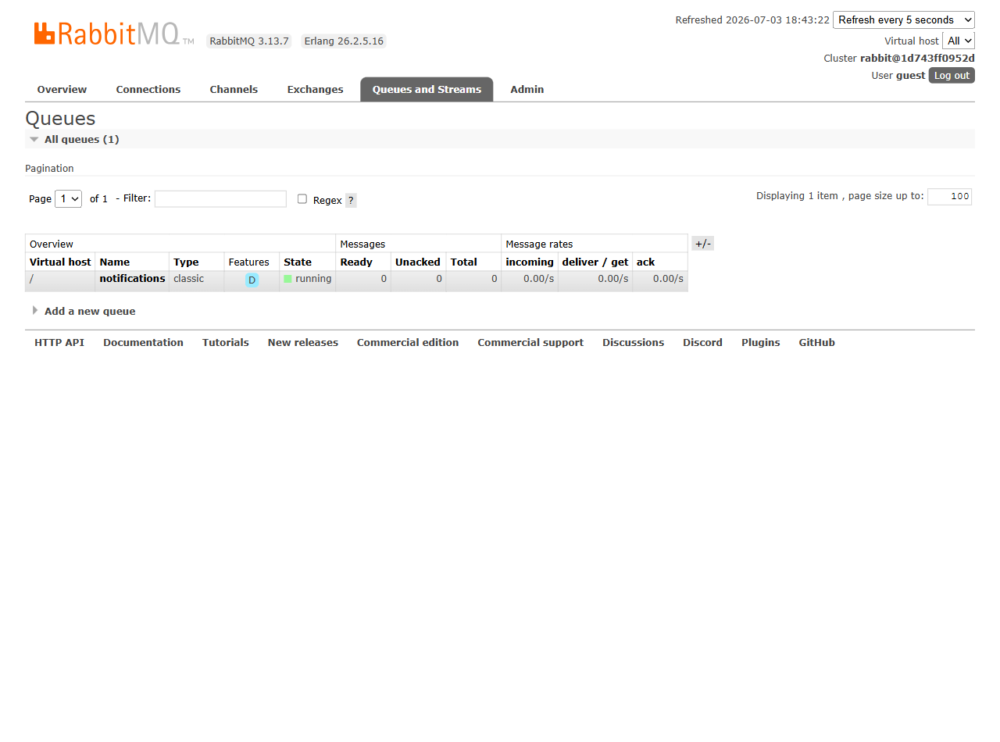

# DriveNow — Vehicle Management System

A small, layered vehicle-rental service: a **FastAPI** REST API that manages cars and rentals on **PostgreSQL**, publishes rental events to **RabbitMQ** for a separate worker process, and exposes **Prometheus** metrics and structured logging. The whole stack runs with one `docker compose up --build`.

## Architecture



### Layers — and the one rule per layer

| Layer | Where | Responsibility | The rule |
|---|---|---|---|
| **API** | `app/api/routers/` | HTTP only: parse the request, call a service, map domain errors to status codes | No business logic here |
| **Service** | `app/services/` | All business rules ("can't rent an unavailable car", "ending a rental frees the car") + publishing events | No SQL or HTTP here |
| **Repository** | `app/repositories/` | CRUD against the DB via SQLAlchemy | No business rules here |
| **Models / Schemas** | `app/models/` / `app/schemas/` | DB shapes vs. API shapes, kept separate | The API contract doesn't change just because a DB column did |

Why layers at all: every business rule has exactly one home, the rules are unit-testable with a fake repository and a fake publisher (no HTTP server, no broker), and infrastructure is swappable — services receive repositories and the event publisher via constructor injection, which is also what makes the tests trivial to wire.

### In brief

A request lands on a FastAPI router, which validates it against a Pydantic schema and calls a service. The service enforces the business rules and reads/writes PostgreSQL through the repositories, inside a single transaction per request. When a rental starts or ends, the service publishes a `rental.created` / `rental.ended` event to a RabbitMQ topic exchange **after** the commit, and a separate worker process consumes those events on its own schedule — so notification work can never block or fail an API request. Around all of that, middleware logs and times every request, feeding the Prometheus metrics served at `/metrics`.

### Project structure

```
app/
├── main.py              # app wiring: logging, middleware, routers, /metrics
├── core/                # settings (env vars), logging setup, metric definitions
├── models/              # SQLAlchemy ORM models (Car, Rental, CarStatus)
├── schemas/             # Pydantic request/response models
├── repositories/        # data access (CarRepository, RentalRepository)
├── services/            # business rules (CarService, RentalService) + domain exceptions
├── api/routers/         # HTTP endpoints (cars, rentals, health)
└── events/              # RabbitMQ publisher + shared exchange/queue constants
worker/consumer.py       # separate process: consumes rental events from the queue
tests/                   # pytest suite (32 tests)
docker-compose.yml       # db + rabbitmq + app + worker
```

## How to run

Prerequisites: Docker with the Compose plugin. Nothing else — Python is not needed on the host.

```bash
git clone <repo-url>
cd Vehicle-Management-System
cp .env.example .env          # Windows cmd: copy .env.example .env
docker compose up --build
```

Four containers start in dependency order — Postgres and RabbitMQ are health-checked, and the API and worker wait for them to be *ready*, not just started:

| Container | Role |
|---|---|
| `drivenow_db` | PostgreSQL 16 (data persists in a named volume across restarts) |
| `drivenow_rabbitmq` | RabbitMQ 3 with the management UI |
| `drivenow_app` | the FastAPI service (uvicorn, port 8000) |
| `drivenow_worker` | the event-consumer process |

| URL | What you get |
|---|---|
| <http://localhost:8000/docs> | interactive Swagger UI — every endpoint, try-it-out |
| <http://localhost:8000/health> | liveness check |
| <http://localhost:8000/metrics> | Prometheus metrics |
| <http://localhost:15672> | RabbitMQ management UI (credentials from `.env`, default `guest`/`guest`) |

Tables are created automatically on startup, so a fresh database needs no migration step.

## API usage

| Method & path | What it does | Success | Errors |
|---|---|---|---|
| `POST /cars` | Add a car `{model, year}` | `201` + car | `422` bad body |
| `GET /cars?status=available` | List cars, optional status filter | `200` + list | `422` bad status value |
| `GET /cars/{id}` | Get one car | `200` | `404` |
| `PATCH /cars/{id}` | Update details / change status | `200` | `404`, `409` illegal transition |
| `DELETE /cars/{id}` | Delete a car | `204` | `404`, `409` has rental history |
| `POST /rentals` | Register a rental `{car_id, customer_name}` | `201` + rental | `404` no such car, `409` not available |
| `POST /rentals/{id}/end` | End a rental → car becomes available | `200` | `404`, `409` already ended |
| `GET /rentals?active=true` | List rentals (all / ongoing / ended) | `200` | — |
| `GET /health` | Liveness check | `200` | — |
| `GET /metrics` | Prometheus scrape endpoint | `200` | — |

Status codes carry the meaning: `404` = doesn't exist, `409` = exists but a business rule forbids the action, `422` = malformed input. Ending a rental is `POST /rentals/{id}/end` rather than a `DELETE`, because it's a business action (it also frees the car), not a record deletion.

A full walkthrough:

```bash
# add a car
curl -X POST localhost:8000/cars -H "Content-Type: application/json" \
     -d '{"model": "Mazda 3", "year": 2022}'
# → 201 {"id": 1, "model": "Mazda 3", "year": 2022, "status": "available", ...}

# rent it
curl -X POST localhost:8000/rentals -H "Content-Type: application/json" \
     -d '{"car_id": 1, "customer_name": "Ofek"}'
# → 201 {"id": 1, "car_id": 1, "end_date": null, ...}      (car 1 is now "rented")

# try to rent it again
curl -X POST localhost:8000/rentals -H "Content-Type: application/json" \
     -d '{"car_id": 1, "customer_name": "Dana"}'
# → 409 {"detail": "Car 1 is not available (status: rented)"}

# try to force the car back to "available" while the rental is active
curl -X PATCH localhost:8000/cars/1 -H "Content-Type: application/json" \
     -d '{"status": "available"}'
# → 409 {"detail": "Car 1 has an active rental; end the rental first"}

# end the rental — sets end_date AND frees the car, in one transaction
curl -X POST localhost:8000/rentals/1/end
# → 200 (car 1 is "available" again)

# list ongoing rentals
curl "localhost:8000/rentals?active=true"
```

## Data model & business rules



All business rules live in the service layer:

1. Renting is allowed only when the car is `available` → otherwise `409`.
2. Ending a rental sets `end_date` **and** frees the car — one transaction.
3. A car with an ongoing rental cannot be deleted, moved to maintenance, or manually forced back to `available` — ending the rental is the only exit from `rented` → `409`.
4. A car with *any* rental history cannot be deleted (history is business data) → `409`. Soft-delete is the future improvement.

### The concurrency trick

"At most one active rental per car" is enforced by the database itself, not just by application code:

```sql
CREATE UNIQUE INDEX one_active_rental_per_car
    ON rentals (car_id) WHERE end_date IS NULL;
```

`end_date IS NULL` *is* the definition of "ongoing" (no separate flag to keep in sync), and the partial unique index makes a double-rent race impossible: if two requests rent the same car simultaneously, both may pass the service-layer availability check, but the database rejects the second insert. The service catches that violation and returns the same `409` as any availability conflict — the service check exists for the friendly error message, the constraint is the race-proof safety net.

## Tests

```bash
docker compose up -d
docker exec drivenow_app python -m pytest -v
```

The suite runs **against a real PostgreSQL**, not SQLite: on first run it creates a separate `drivenow_test` database, and every test runs inside a transaction that is rolled back at the end, so tests are isolated from each other and from development data. Real Postgres was chosen deliberately — the partial unique index above is Postgres-specific, and the concurrency guarantee it provides is exactly the kind of thing worth testing for real. That's also why tests run inside the container (where the database is reachable) rather than on the host.

The RabbitMQ publisher is swapped for an in-memory fake in tests (the same constructor injection used everywhere), so the suite asserts *that* events are published — without a broker and without polluting a real queue.

What's covered: every business rule above (including the concurrent double-rent race, simulated deterministically), the HTTP status-code mapping (`201`/`404`/`409`/`422`), event publishing for rental create/end, and the metrics endpoint (gauges and counters actually move when cars and rentals change).

<details>
<summary><code>pytest -v</code> output — 32 passed</summary>

```
tests/test_api.py::test_read_root PASSED                                 [  3%]
tests/test_api.py::test_health_check PASSED                              [  6%]
tests/test_car_service.py::test_add_car_default_status_available PASSED  [  9%]
tests/test_car_service.py::test_list_cars_filter_by_status PASSED        [ 12%]
tests/test_car_service.py::test_get_car_not_found_raises PASSED          [ 15%]
tests/test_car_service.py::test_cannot_delete_car_with_active_rental PASSED [ 18%]
tests/test_car_service.py::test_cannot_delete_car_with_ended_rental_history PASSED [ 21%]
tests/test_car_service.py::test_cannot_set_status_to_rented_directly PASSED [ 25%]
tests/test_car_service.py::test_cannot_free_rented_car_directly PASSED   [ 28%]
tests/test_car_service.py::test_cannot_move_rented_car_to_maintenance PASSED [ 31%]
tests/test_cars_api.py::test_create_car_returns_201 PASSED               [ 34%]
tests/test_cars_api.py::test_create_car_invalid_year_returns_422 PASSED  [ 37%]
tests/test_cars_api.py::test_create_car_future_year_returns_422 PASSED   [ 40%]
tests/test_cars_api.py::test_get_unknown_car_returns_404 PASSED          [ 43%]
tests/test_cars_api.py::test_free_rented_car_via_patch_returns_409 PASSED [ 46%]
tests/test_cars_api.py::test_delete_car_with_rental_returns_409 PASSED   [ 50%]
tests/test_metrics.py::test_metrics_endpoint_exposes_expected_series PASSED [ 53%]
tests/test_metrics.py::test_creating_car_sets_available_gauge PASSED     [ 56%]
tests/test_metrics.py::test_registering_rental_updates_ongoing_and_created_metrics PASSED [ 59%]
tests/test_metrics.py::test_ending_rental_decrements_ongoing_gauge PASSED [ 62%]
tests/test_rental_service.py::test_register_rental_marks_car_rented PASSED [ 65%]
tests/test_rental_service.py::test_cannot_rent_unavailable_car PASSED    [ 68%]
tests/test_rental_service.py::test_register_rental_unknown_car_raises PASSED [ 71%]
tests/test_rental_service.py::test_concurrent_rental_conflict_maps_to_domain_error PASSED [ 75%]
tests/test_rental_service.py::test_end_rental_frees_car PASSED           [ 78%]
tests/test_rental_service.py::test_cannot_end_already_ended_rental PASSED [ 81%]
tests/test_rental_service.py::test_end_unknown_rental_raises PASSED      [ 84%]
tests/test_rental_service.py::test_rental_created_event_published PASSED [ 87%]
tests/test_rental_service.py::test_rental_ended_event_published PASSED   [ 90%]
tests/test_rentals_api.py::test_register_and_end_rental_flow PASSED      [ 93%]
tests/test_rentals_api.py::test_rent_unavailable_car_returns_409 PASSED  [ 96%]
tests/test_rentals_api.py::test_register_rental_unknown_car_returns_404 PASSED [100%]

======================== 32 passed, 1 warning in 0.70s =========================
```

</details>

## Observability

**Logging** — Python's `logging` with two handlers, exactly as the exercise asks: console (what `docker logs` shows) and a rotating file (`logs/app.log`, 5 MB × 3 backups). Every module logs under its own name, so a line reads like a story: `2026-07-03 15:21:08 | INFO | app.services.rental_service | rental 6 created for car 1 (customer=FinalCheck)`. Business events log at `INFO`, rejected business rules at `WARNING`, unhandled failures at `ERROR` with a stack trace, and every HTTP request is logged by middleware (method, path, status, duration). Set `DEBUG=true` in `.env` to also see repository-level detail — no code changes needed.

**Metrics** — `prometheus_client`, pull-based: the app keeps the numbers in memory and exposes them at `GET /metrics` for a Prometheus server to scrape.

| Metric | Type | Meaning |
|---|---|---|
| `drivenow_cars_total{status=...}` | Gauge | cars per status, recomputed from the DB on every change (no drift) |
| `drivenow_ongoing_rentals` | Gauge | rentals currently active |
| `drivenow_rentals_created_total` | Counter | rentals ever created |
| `drivenow_request_duration_seconds{method,path}` | Histogram | request latency, labeled by route *template* (low cardinality) |

Live sample:

```
drivenow_cars_total{status="available"} 2.0
drivenow_cars_total{status="rented"} 1.0
drivenow_cars_total{status="maintenance"} 1.0
drivenow_ongoing_rentals 1.0
drivenow_rentals_created_total 6.0
drivenow_request_duration_seconds_count{method="POST",path="/rentals"} 3.0
drivenow_request_duration_seconds_sum{method="POST",path="/rentals"} 0.0626
```

The histogram exposes `_sum` and `_count`, so average latency = sum ÷ count — here `0.0626 / 3 ≈ 21 ms` per `POST /rentals`.

## Screenshots

**Swagger UI** (`/docs`):



**Prometheus metrics** (`/metrics`):



**RabbitMQ management UI** — the `notifications` queue, bound to `rental.*`, with the worker connected as a consumer:


